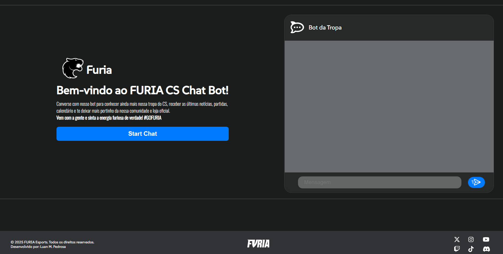

# 🦊 FURIA Fan Chatbot – Landing Page Interativa

Projeto desenvolvido para conectar fãs do time de CS:GO da FURIA com uma interface interativa e responsiva. A página reúne informações do time e oferece um **chatbot exclusivo**, que simula uma conversa com o time, fornecendo curiosidades, próximos jogos e links para redes sociais e produtos da loja oficial.

## Summary
- [Objetivo](#1-objetivo)
- [Funcionalidades](#2-funcionalidades)
- [Rodar Localmente](#3-como-rodar-o-projeto-localmente)
- [Demonstração](#4-demonstração)
- [Tecnologias](#5-️tecnologias-utilizadas)
- [Observações](#6-observações-técnicas)
- [Autor](#7-️autor)

## 1 🚀 Objetivo

Criar uma **landing page moderna** com um **chatbot funcional** que proporcione uma experiência divertida e informativa aos fãs da FURIA, utilizando tecnologias web acessíveis e responsivas. O projeto atende aos critérios do desafio proposto, incluindo protótipo navegável, integração com redes sociais e documentação no GitHub.

## 2 🧠 Funcionalidades

- 🗣️ Chatbot com respostas pré-definidas sobre:
  - História da FURIA
  - Jogos do time de CS:GO
  - Próximos jogos
- 📈 API com acesso a planilhas Google Sheets para retornar ao usuário os próximos jogos do time
- 🔗 Links diretos para redes sociais da FURIA (Twitter, Instagram, YouTube, X, Canal Discord, TikTok)
- 📱 Design responsivo adaptado para dispositivos móveis
- 🎨 Estilo visual inspirado nas cores e identidade da FURIA

## 3 ⚙️ Como Rodar o Projeto Localmente
Esse projeto está rodando remotamente pelo endereço: https://frontend-chat-furia.vercel.app/ mas caso queira testar e rodar localmente:

```bash
$ git clone https://github.com/luan048/LandingPage-chatbot-furia.git
```

```bash
$ npm install
```

- Para rodar front-end localmente
```bash
$ cd front-end
```

```bash
$ npm run dev
```

- Para rodar back-end localmente
```bash
$ cd back-end
```

```bash
$ npm run dev
```

## 4 📸 Demonstração


## 5 🛠️ Tecnologias Utilizadas

- **React** para desenvolver front-end e suas funções
- **Google APIS** para conectar com planilha Google Sheets

## 6 📌 Observações Técnicas
- O chatbot utiliza respostas baseadas em palavras-chave.

## 7 ✍️ Autor
• Luan Monteiro Pedrosa - Desenvolvedor Full-Stack